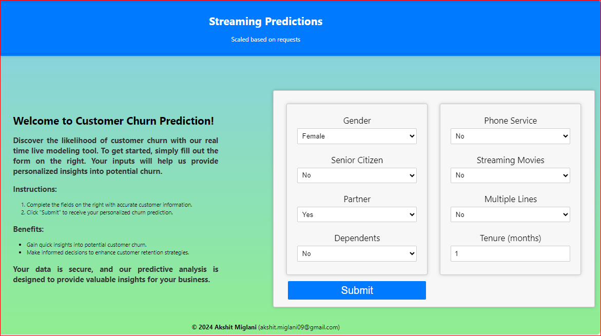

# Customer Churn Prediction Frontend

Welcome to the Customer Churn Prediction Frontend repository! This repository contains the frontend code for interacting with the customer churn prediction system. This README provides an overview of the project structure, components, flow, and key learnings.

## Overview

This project aims to provide users with an intuitive web interface for submitting customer information and receiving churn prediction results from the deployed machine learning model. The frontend is built using React.js, ensuring a responsive and interactive user experience.

## Project Structure

### Components
- **App.js**: Main entry point of the application. Renders child components and manages overall structure.
- **MyComponent.js**: Handles user interaction, form submission, and result display.
- **ProjectInfo.js**: Displays project information and details.

### CSS
- **MyComponent.css**: Stylesheet for MyComponent.js.
- **App.css**: Main stylesheet for styling the application.

## Flow Overview

1. **App.js - Entry Point**: Renders the main structure of the application, including ProjectInfo and MyComponent.
2. **MyComponent.js - Form Handling**: Manages form submission, user input handling, and result display.
3. **ProjectInfo.js - Project Information**: Displays project details and information.

## Detailed Flow

Refer to the provided detailed flow documentation for a comprehensive understanding of the component interaction, state management, and user flow within the application.

## Additional Notes and Learnings

### Understanding CSS Class Naming
In CSS, when you have multiple class names in a single HTML element, such as 
, the classes are combined without spaces when referenced in CSS selectors. For example, .result-container.text-container targets elements that have both classes applied to them. This is crucial to remember when styling components in React, as it affects how you write your CSS selectors to target specific elements accurately.

### Component Interaction and Separation of Concerns
Your application follows a clear separation of concerns, with each component responsible for specific functionality. For instance, MyComponent handles form input, submission logic, and result display, while ProjectInfo is dedicated to displaying project information. This modular approach makes your codebase easier to understand, maintain, and scale, as each component focuses on a single responsibility. It also promotes reusability, as components can be easily reused in different parts of your application or in other projects.

### Handling CORS Issues
When integrating your React frontend with a backend hosted on AWS Elastic Beanstalk, you encountered CORS-related errors due to security restrictions. CORS (Cross-Origin Resource Sharing) is a security mechanism implemented by web browsers to restrict cross-origin HTTP requests. To resolve CORS errors, you need to configure your backend server to accept requests from your frontend domain. This typically involves setting appropriate CORS headers on the server-side to allow cross-origin requests. By addressing CORS issues, you ensure seamless communication between your frontend and backend components, enabling the proper functioning of your application.

### Asynchronous Programming with Async/Await
Asynchronous programming, utilizing features like async/await in JavaScript, is essential for handling tasks that involve waiting for responses from external services, such as making HTTP requests. In your code, async/await is used to ensure that the UI remains responsive while waiting for server responses. By marking asynchronous functions with the async keyword and using await to pause execution until promises are resolved, you prevent blocking the main thread and maintain a smooth user experience. Asynchronous programming enables concurrent execution of tasks, improving overall application performance and responsiveness.

### Debugging and Troubleshooting
Encountering errors, such as CORS issues during development, is common in web development projects. Effective debugging techniques, such as logging and using browser developer tools, are essential for identifying and resolving issues promptly. When facing errors like CORS-related issues, inspecting network requests and server responses can provide valuable insights into the root cause of the problem. Additionally, thorough error handling in your code, including try-catch blocks, ensures graceful handling of errors and prevents application crashes, contributing to a more robust and reliable application.

## Next Steps

If you encounter any issues or errors, refer to the provided documentation and debug accordingly. Ensure seamless communication between the frontend and backend to enable accurate prediction results.

Thank you for using the Customer Churn Prediction Frontend! For any further assistance or inquiries, please reach out to the project maintainers.

# Getting Started with Create React App

This project was bootstrapped with [Create React App](https://github.com/facebook/create-react-app).

## Available Scripts

In the project directory, you can run:

### `npm start`

Runs the app in the development mode.\
Open [http://localhost:3000](http://localhost:3000) to view it in your browser.

The page will reload when you make changes.\
You may also see any lint errors in the console.

### `npm test`

Launches the test runner in the interactive watch mode.\
See the section about [running tests](https://facebook.github.io/create-react-app/docs/running-tests) for more information.

### `npm run build`

Builds the app for production to the `build` folder.\
It correctly bundles React in production mode and optimizes the build for the best performance.

The build is minified and the filenames include the hashes.\
Your app is ready to be deployed!

See the section about [deployment](https://facebook.github.io/create-react-app/docs/deployment) for more information.

### `npm run eject`

**Note: this is a one-way operation. Once you `eject`, you can't go back!**

If you aren't satisfied with the build tool and configuration choices, you can `eject` at any time. This command will remove the single build dependency from your project.

Instead, it will copy all the configuration files and the transitive dependencies (webpack, Babel, ESLint, etc) right into your project so you have full control over them. All of the commands except `eject` will still work, but they will point to the copied scripts so you can tweak them. At this point you're on your own.

You don't have to ever use `eject`. The curated feature set is suitable for small and middle deployments, and you shouldn't feel obligated to use this feature. However we understand that this tool wouldn't be useful if you couldn't customize it when you are ready for it.

## Learn More

You can learn more in the [Create React App documentation](https://facebook.github.io/create-react-app/docs/getting-started).

To learn React, check out the [React documentation](https://reactjs.org/).

### Code Splitting

This section has moved here: [https://facebook.github.io/create-react-app/docs/code-splitting](https://facebook.github.io/create-react-app/docs/code-splitting)

### Analyzing the Bundle Size

This section has moved here: [https://facebook.github.io/create-react-app/docs/analyzing-the-bundle-size](https://facebook.github.io/create-react-app/docs/analyzing-the-bundle-size)

### Making a Progressive Web App

This section has moved here: [https://facebook.github.io/create-react-app/docs/making-a-progressive-web-app](https://facebook.github.io/create-react-app/docs/making-a-progressive-web-app)

### Advanced Configuration

This section has moved here: [https://facebook.github.io/create-react-app/docs/advanced-configuration](https://facebook.github.io/create-react-app/docs/advanced-configuration)

### Deployment

This section has moved here: [https://facebook.github.io/create-react-app/docs/deployment](https://facebook.github.io/create-react-app/docs/deployment)

### `npm run build` fails to minify

This section has moved here: [https://facebook.github.io/create-react-app/docs/troubleshooting#npm-run-build-fails-to-minify](https://facebook.github.io/create-react-app/docs/troubleshooting#npm-run-build-fails-to-minify)
